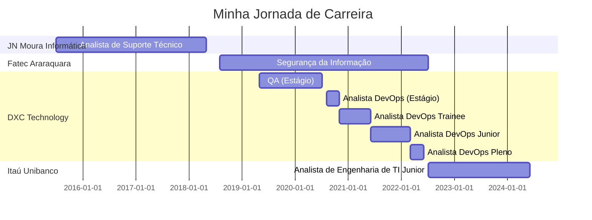

# Plano de Desenvolvimento Individual (PDI)

## Informações Pessoais

- **Nome:** Renan Phellip Santana de Morais
- **Formação:** Tecnólogo em Segurança da Informação pela FATEC Araraquara
- **Cargo Atual:** Analista de Engenharia de TI Junior no Itaú Unibanco
- **Data de Início:** 11/07/2022
- **Tempo de empresa:** 1 ano e 8 meses
- **Data de Revisão do PDI:** 25/03/2024

## Minha Jornada de Carreira

## Visão Geral

- [x] Continuar me aprimorando e fazer uso de minhas habilidades para criar e disponibilizar um produto de muito valor para o negócio com alta satisfação dos usuários.

## Objetivos

### Objetivos Profissionais

- [ ] Utilizar em nosso produto alguma tecnologia, ferramenta ou metodologia sugerida por mim para aprimorar a jornada de exposição de APIs ou a experiência do usuário.
- [ ] Ser reconhecido como nível Pleno até 09/2024.

### Objetivos Pessoais

- [x] Manter um equilíbrio saudável entre vida profissional e pessoal, dedicando tempo suficiente ao lazer, família e hobbies.
- [ ] Alcançar o nível básico de comunicação oral em inglês até 12/2024.

## Plano de Ação

### Desenvolvimento Profissional

- [x] Entender quais os requisitos esperados de um nível Pleno em nossa Comunidade até 09/2023.
- [x] Contribuir toda sprint com a documentação técnica do produto ou interna do time.
- [ ] Criar um sistema de contribuição fácil, eficiente e rastreável em repositórios da experiência até 06/2024.
- [ ] Fazer um meetup por release para a squad.
- [ ] Todo ano trazer algum conhecimento técnico para a Comunidade do banco.

### Desenvolvimento Pessoal

- [x] Organizar a rotina de trabalho, estudo e treino diariamente.
- [x] Expandir o vocabulário em inglês com pelo menos 30 palavras novas por semana.
- [ ] Atingir imersão total no inglês até 05/2024.

### Desenvolvimento de Habilidades Técnicas

- [x] Evoluir o projeto [OAS CLI](https://github.com/renanphellip/oas-cli) continuamente durante os finais de semana.
- [ ] Dominar as principais funcionalidades do serviço de AWS API Gateway do tipo RESTful até 07/2024.
- [ ] Concluir o curso Python Base da LINUXtips até 12/2024.

## Autoavaliação de Competências

Considerando a escala de progressão (Iniciante, Intermediário, Avançado, Especialista) em cada tema:

- Linguagens Gerais (Script / Programação / Marcação):
    | Nível | Habilidade |
    | - | - |
    | Iniciante | Java |
    | Intermediário | Typescript (Node.js) |
    | Intermediário | Python |
    | Intermediário | Bash Scripting |
    | Intermediário | Markdown |

- Sistemas Operacionais:
    | Nível | Habilidade |
    | - | - |
    | Iniciante | Windows |
    | Iniciante | Linux (Ubuntu, RHEL, CentOS) |

- Sistemas de Controle de Versão:
    | Nível | Habilidade |
    | - | - |
    | Intermediário | Git |

- Plataformas de Controle de Versão:
    | Nível | Habilidade |
    | - | - |
    | Iniciante | Gitlab |
    | Intermediário | Azure Repos |
    | Intermediário | Github |

- Containers, Orquestradores e Registries:
    | Nível | Habilidade |
    | - | - |
    | Iniciante | Kubernetes / Openshift |
    | Iniciante | EKS / AKS |
    | Intermediário | Docker |

- Provedores de Nuvem:
    | Nível | Habilidade |
    | - | - |
    | Iniciante | Azure |
    | Iniciante | AWS |

- Conceitos de Rede, Segurança e Protocolos:
    | Nível | Habilidade |
    | - | - |
    | Iniciante | FTP / FSTP |
    | Iniciante | HTTP / HTTPS |
    | Iniciante | SSL / TLS |
    | Iniciante | DNS |
    | Iniciante | SSH |
    | Iniciante | Modelo OSI |

- Serviços Serverless:
    | Nível | Habilidade |
    | - | - |
    | Iniciante | Azure Functions |
    | Iniciante | AWS Lambda |

- Infraestrutura como Código:
    | Nível | Habilidade |
    | - | - |
    | Iniciante | Terraform |
    | Iniciante | AWS CloudFormation |

- Plataformas de CI/CD:
    | Nível | Habilidade |
    | - | - |
    | Iniciante | Gitlab CI |
    | Intermediário | Azure DevOps |
    | Intermediário | Github Actions |

- Gerenciamento de Artefatos:
    | Nível | Habilidade |
    | - | - |
    | Iniciante | JFrog Artifactory |
    | Intermediário | Azure Artifacts |
    | Intermediário | Nexus Artifactory |

- Banco de Dados Relacionais:
    | Nível | Habilidade |
    | - | - |
    | Iniciante | Microsoft SQL Server |
    | Iniciante | Oracle |
    | Iniciante | MySQL |

- Conceitos sobre APIs:
    | Nível | Habilidade |
    | - | - |
    | Iniciante | AWS API Gateway |
    | Intermediário | REST |
    | Intermediário | OpenAPI 3 |

- Testes e Qualidade:
    | Nível | Habilidade |
    | - | - |
    | Iniciante | SonarQube |
    | Iniciante | Testes de Integração |
    | Intermediário | Testes Unitários |
    | Intermediário | Testes Funcionais |

- Padrões de Arquiteturas:
    | Nível | Habilidade |
    | - | - |
    | Iniciante | Aplicações Monolíticas |
    | Iniciante | Serverless |
    | Intermediário | Microsserviços |

## Monitoramento e Avaliação

- [x] Revisar o progresso do PDI todo mês.
- [x] Atualizar o registro das atividades concluídas e resultados alcançados regularmente.

## Suporte e Feedback

- [x] Buscar feedback com a gerência, liderança e pares todo mês.
- [x] Manter contato regular com um mentor para orientação.

## Revisão do PDI

- [x] Agendar reuniões de revisão do PDI com a coordenação todo mês.
- [x] Ajustar metas e ações conforme a evolução da carreira e dos objetivos pessoais.

## Compromisso

- [x] Comprometo-me a seguir este PDI para alcançar meus objetivos de carreira e desenvolvimento pessoal.

---

*Este PDI representa meu compromisso em buscar crescimento profissional e pessoal contínuo, e será revisado periodicamente para acompanhar meu progresso em direção a esses objetivos.*
